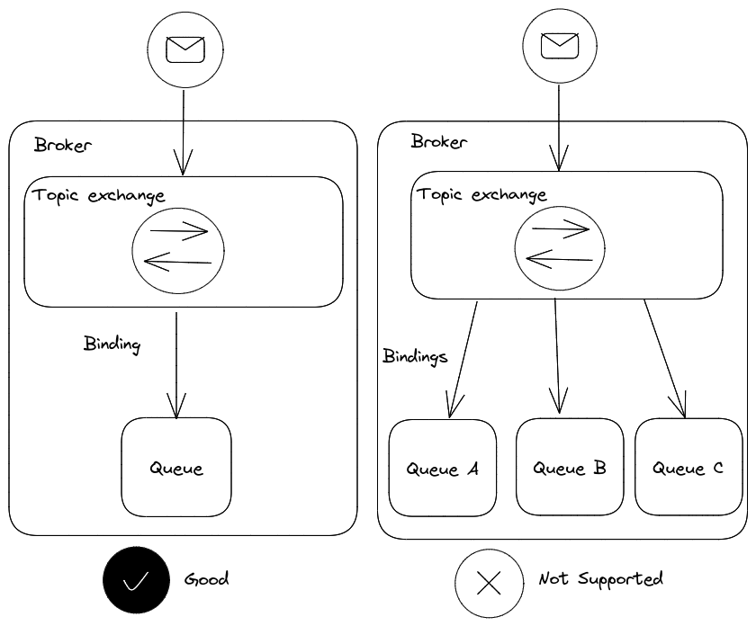
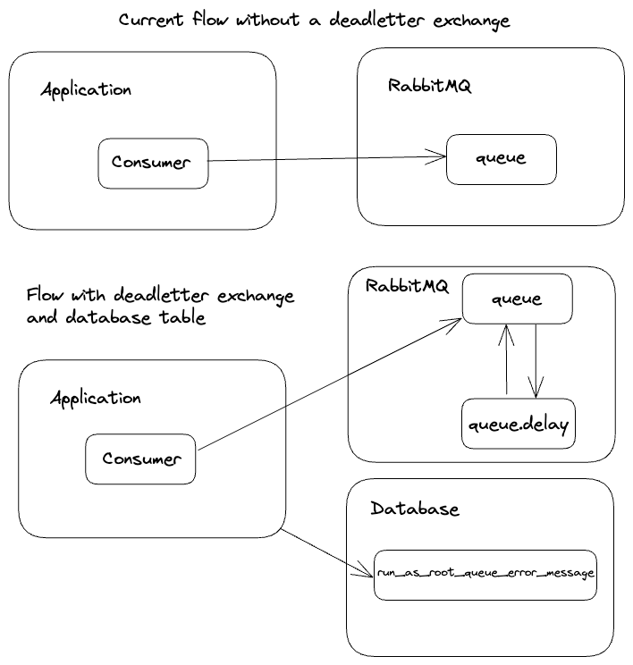
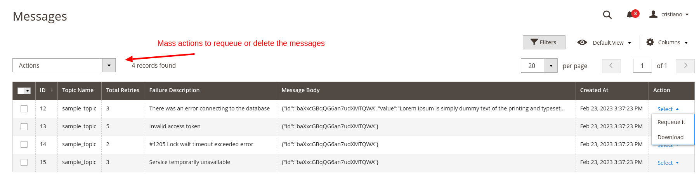
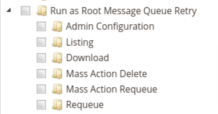
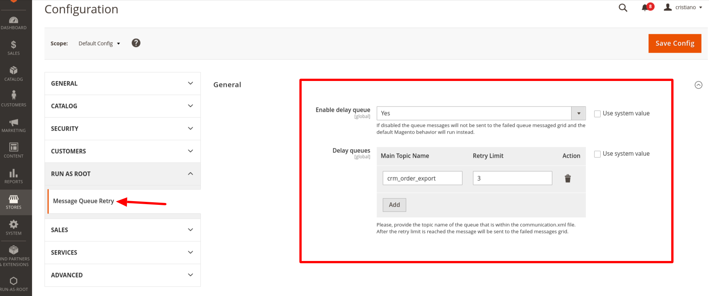

# run-as-root/magento2-message-queue-retry

It gives the possibility to process the same queue message more than once, 
utilizing The RabbitMQ's [dead letter exchange](https://www.rabbitmq.com/dlx.html)  feature.

## Table of Contents
- [Prerequisites](#prerequisites)
- [Installation](#installation)
- [Features](#features)
- [How it works](#how-it-works)
- [Configuration](#configuration)
- [License](#licence)

## Prerequisites

- Magento 2.4.5 or higher
- PHP 8.1 or higher
- RabbitMQ

To be able to use this module, you have to manually configure the dead letter exchange(s) for the queue(s) you want to enable the retry mechanismm through the `queue_topology.xml` file.
An example will be given in the Setup section.

Other requisite is that your exchanges have to have a relation from one exchange to only one topic and queue, 

For example:


## Installation

To install the module via composer:
```bash
composer require run-as-root/magento2-message-queue-retry
```

To enable the module:
```bash
bin/magento module:enable RunAsRoot_MessageQueueRetry
```

## Features

- Toggle activation
- Configure the retry limit for a queue
- Admin grid to manage the messages with the retry limit reached
    - Requeue the failed messages to their origin queue
    - Delete the message
    - Download the message body

## How it works

The default Magento's consumer behavior is to reject the message when an exception is thrown during the consumer's execution.
If you use a standard configuration for the queue (without a dead-letter exchange), the message will be discarded and not processed again.

This behavior will change a bit with this module. It will introduce an extra step that will check if the message has reached your retry limit,
if so, it will be discarded from RabbitMQ and sent to the `run_as_root_message` Mysql table and stay there until manual management through the admin panel.

If it has not reached the retry limit, the message will be rejected, and RabbitMQ will be sent to the dead letter exchange and routed automatically to the "delay" queue and stay there until de TTL time is reached.
After the TTL time is reached, the message will be sent to the original queue and processed by the consumer.

The diagram below illustrates both approaches:


In the admin panel a new grid will be available to manage the messages that have reached the retry limit:

Path: RunAsRoot > Manage Messages



The grid colums:

- **Topic name**: The name of the topic that the message belongs to
- **Total retries**: The total number of times the message has been processed
- **Failure Description**: The exception message that was thrown during the processing of the message
- **Message Body**: The original message body, it can be downloaded as a file and it is in JSON format.

The grid actions:

- **Requeue**: It will send the message to the original queue
- **Download**: It will download the message body content as a JSON file

The grid also has a mass action to delete or requeue the selected messages.

Is possible to configure the ACL for each action in the grid and the module configuration:



### Configuration

Two steps are necessary to configure the retry for a queue:
1. Configure the dead letter exchange
1. Enable the message queue retry and delclare the retry limit configuration

Let's imagine a scenario that the `erp_order_export` queue already exists in your project and to simplify the example the topic name, exchange name and queue name are the same: `erp_order_export`.

We need to change these two files in order to declare and configure the delay queue:
- `communication.xml`
- `queue_topology.xml`

**The current queue configuration are like this**:

`etc/communication.xml`:

```xml
<?xml version="1.0"?>
<config xmlns:xsi="http://www.w3.org/2001/XMLSchema-instance"
        xsi:noNamespaceSchemaLocation="urn:magento:framework:Communication/etc/communication.xsd">
    <topic name="erp_order_export" request="string"/>
</config>
```

`etc/queue_topology.xml`:

```xml
<?xml version="1.0"?>
<config xmlns:xsi="http://www.w3.org/2001/XMLSchema-instance"
        xsi:noNamespaceSchemaLocation="urn:magento:framework-message-queue:etc/topology.xsd">
    <exchange name="erp_order_export" connection="amqp" type="topic">
        <binding id="erp_order_export" topic="erp_order_export" destinationType="queue" destination="erp_order_export"/>
    </exchange>
</config>
```

**You have to change it to**:

`etc/communication.xml`:

```xml
<?xml version="1.0"?>
<config xmlns:xsi="http://www.w3.org/2001/XMLSchema-instance"
        xsi:noNamespaceSchemaLocation="urn:magento:framework:Communication/etc/communication.xsd">
    <topic name="erp_order_export" request="string"/>
    <topic name="erp_order_export_delay" request="string"/>
</config>
```

`etc/queue_topology.xml`:
```xml
<?xml version="1.0"?>
<config xmlns:xsi="http://www.w3.org/2001/XMLSchema-instance"
        xsi:noNamespaceSchemaLocation="urn:magento:framework-message-queue:etc/topology.xsd">
    <exchange name="erp_order_export" connection="amqp" type="topic">
        <binding id="erp_order_export" topic="erp_order_export" destinationType="queue" destination="erp_order_export">
            <arguments>
                <argument name="x-dead-letter-exchange" xsi:type="string">erp_order_export_delay</argument>
                <argument name="x-dead-letter-routing-key" xsi:type="string">erp_order_export_delay</argument>
            </arguments>
        </binding>
    </exchange>
    <exchange name="erp_order_export_delay" connection="amqp" type="topic">
        <binding id="erp_order_export_delay" topic="erp_order_export_delay" destinationType="queue" destination="erp_order_export_delay">
            <arguments>
                <argument name="x-dead-letter-exchange" xsi:type="string">erp_order_export</argument>
                <argument name="x-dead-letter-routing-key" xsi:type="string">erp_order_export</argument>
                <argument name="x-message-ttl" xsi:type="number">300000</argument>
            </arguments>
        </binding>
    </exchange>
</config>
```

In the `erp_order_export` we added the `x-dead-letter-exchange` and `x-dead-letter-routing-key` arguments to the binding, this will route the message to the `erp_order_export_delay` exchange when the message is rejected.

In the `erp_order_export_delay` we added the same arguments, however it points to the original exchange `erp_order_export` and the TTL time is 300000ms (5 minutes).

The `erp_order_export_delay` queue does not have a consumer, it will be used only to hold(delay) messages according with the period defined in the `x-message-ttl` argument. When the lifetime expires (TTL), RabbitMQ will send the message to `erp_order_export` automatically.

Now you have to define toggle the activation for the retry queue module and declare the retry limit for the queue:

System > Configuration > RUN-AS-ROOT > Message Queue Retry



Note that if the queue is not declared in the configuration it will the default Magento consumer behavior.

For more information of how to configure message queues in Magento 2, you can take a look [here](https://developer.adobe.com/commerce/php/development/components/message-queues/configuration/).

## License
[MIT](https://opensource.org/licenses/MIT)
